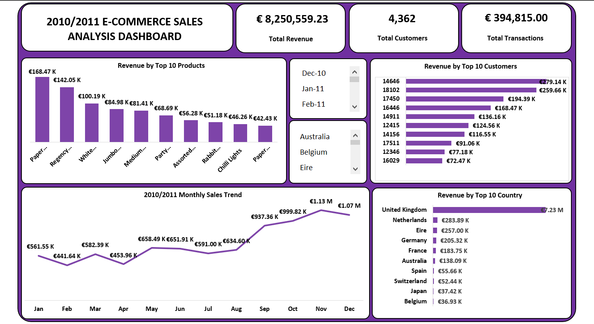

# 🛒 2010/2011 E-Commerce Sales Analysis Dashboard

## Overview

This project analyzes e-commerce sales transactions from 2010–2011 using Microsoft Excel. The dashboard provides insights into revenue performance, customer activity, product sales, and geographic distribution to support data-driven business decisions.

## Business Problem

The business needed a way to monitor sales performance, identify top-performing products and customers, track monthly revenue trends, and understand which countries generated the highest revenue.

The goal was to transform raw transactional data into an interactive dashboard that answers key business questions quickly and effectively.

## Key Metrics

- Total Revenue: €8.25M
- Total Customers: 4,362
- Total Transactions: 394,815

## Dashboard Features

- Revenue by Top 10 Products
- Revenue by Top 10 Customers
- Revenue by Top 10 Countries
- Monthly Sales Trend Analysis
- Interactive Country Filter
- Interactive Date Filter

## Key Insights

- The United Kingdom generated the highest revenue (€7.23M), significantly outperforming other countries.
- Revenue peaked in November at €1.13M, indicating strong seasonal demand.
- The top-performing product generated €168.47K in revenue.
- A small group of customers contributed a large portion of total revenue.
- Sales showed steady growth towards the end of the year, with Q4 delivering the strongest performance.

## Skills Demonstrated

- Microsoft Excel
- Pivot Tables
- Pivot Charts
- Data Cleaning
- Data Transformation
- Dashboard Design
- Data Visualization
- Business Intelligence Reporting

## Tools Used

- Microsoft Excel
- Power Query
- Pivot Charts

## Dashboard

## Author

**Odunola Adewale**

Aspiring Data Analyst | Excel | SQL | Power BI
