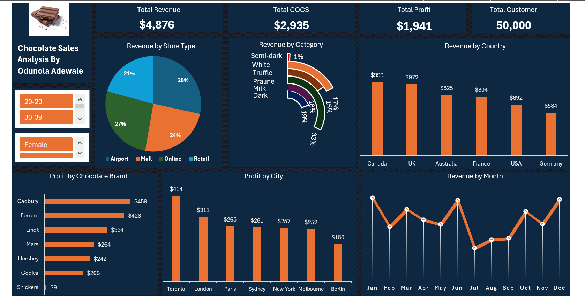

# Chocolate Sales Analysis Dashboard

## Project Overview
This Excel dashboard analyzes chocolate sales performance across countries, brands, customer demographics, and store locations.

The project was designed to track revenue trends, profit performance, and customer insights using interactive Excel dashboarding techniques.

---

## Tools & Features Used
- Microsoft Excel
- Pivot Tables
- Pivot Charts
- Slicers
- Conditional Formatting
- Power Query
- KPI Cards

---

## Dashboard Features
- Revenue by Country
- Profit by Brand
- Revenue Trend by Month
- Profit by City
- Customer Segmentation Analysis
- Store Type Performance

---

## Key Business Insights
- Canada generated the highest revenue.
- Cadbury recorded the highest profit among brands.
- Airport stores contributed significantly to total sales.
- Monthly sales trends revealed seasonal revenue fluctuations.

---

## Data Cleaning
Data cleaning and transformation were performed using Power Query before dashboard creation.

---

## Dashboard Preview

---

## Author
Odunola Adewale
