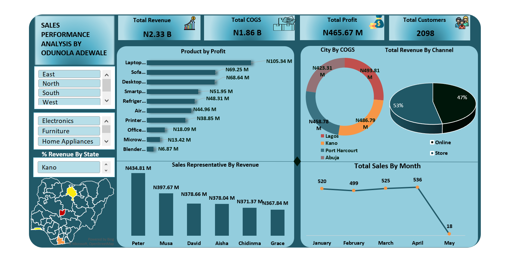

# 📊 Sales Performance Analysis Dashboard

## Overview

This project analyzes sales performance across products, regions, sales representatives, and sales channels using Microsoft Excel. The dashboard provides insights into revenue generation, profitability, customer activity, and cost performance to support business decision-making.

This was my **first-ever Excel data analysis project**, making it a significant milestone in my data analytics journey. It helped me understand how to transform raw business data into meaningful insights through dashboards and visual storytelling.

## Business Problem

Businesses need visibility into sales performance to understand which products generate the most profit, which regions drive revenue, and how sales representatives contribute to overall performance.

The objective was to create an interactive dashboard that enables stakeholders to monitor revenue, profit, customer activity, and sales trends in a single view.

## Key Metrics

- Total Revenue: ₦2.33B
- Total COGS: ₦1.86B
- Total Profit: ₦465.67M
- Total Customers: 2,098

## Dashboard Features

- Product Profit Analysis
- Revenue by Sales Representative
- Revenue by Sales Channel
- City-Level Cost Analysis
- Monthly Sales Trend
- Regional Filtering
- Product Category Filtering
- State-Level Revenue Analysis

## Key Insights

- Laptops generated the highest profit at ₦105.34M.
- Online sales contributed 53% of total revenue, outperforming store sales at 47%.
- Peter generated the highest revenue among all sales representatives at ₦434.81M.
- Lagos recorded the highest COGS among the cities analyzed.
- Sales remained relatively stable from January to April before declining sharply in May.

## Skills Demonstrated

- Microsoft Excel
- Data Cleaning
- Data Analysis
- Pivot Tables
- Pivot Charts
- Dashboard Design
- Data Visualization
- Business Reporting
- KPI Development

## Tools Used

- Microsoft Excel
- Power Query
- Pivot Table

 ## Dashboard Preview

## Author

**Odunola Adewale**

Aspiring Data Analyst | Excel | SQL | Power BI
